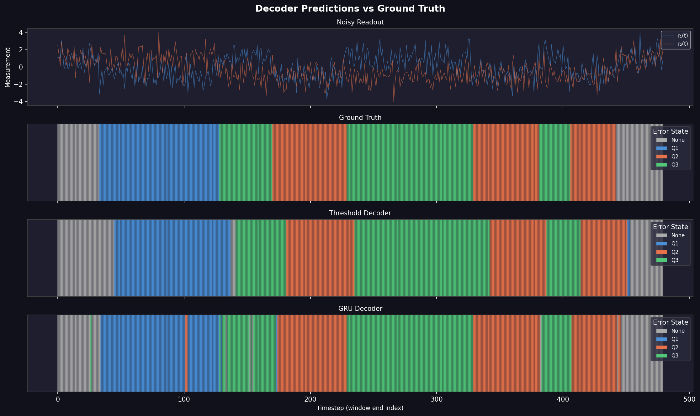
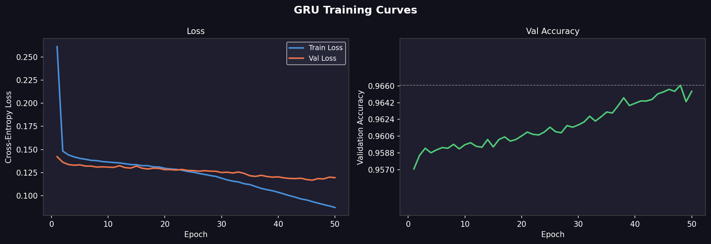
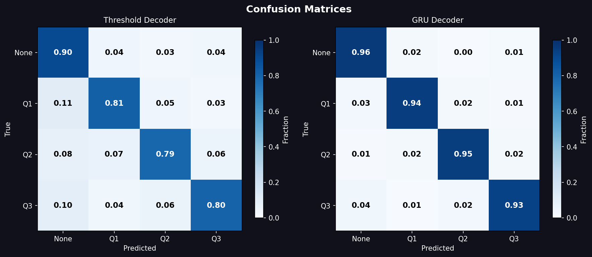
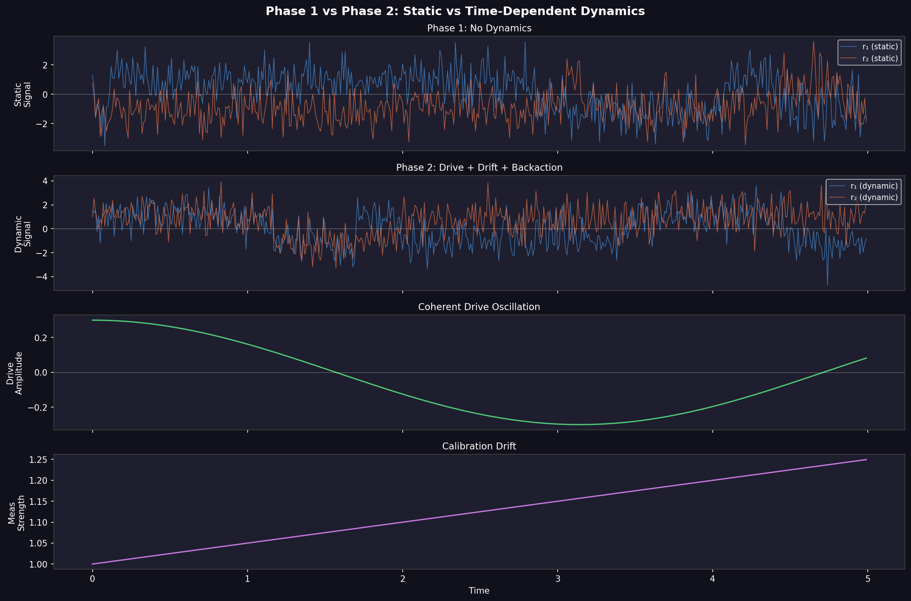
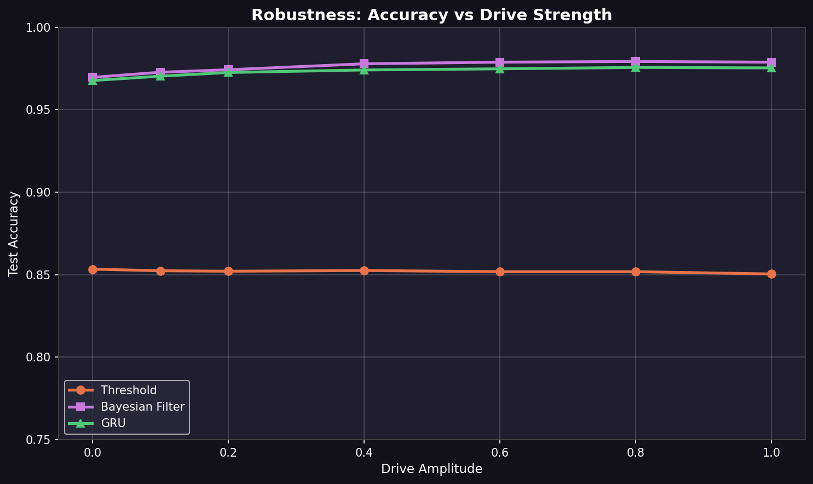

# Continuous Quantum Error Correction with ML Decoders

> Can a neural network decode quantum errors better than Bayes' theorem?

**Authors:** Pranav Reddy ([preddy@ucsb.edu](mailto:preddy@ucsb.edu)) · Clark Enge ([clarkenge@ucsb.edu](mailto:clarkenge@ucsb.edu))

---

## The Problem

Quantum computers are noisy. A 3-qubit repetition code protects information by encoding it across qubits (`|0⟩ₗ = |000⟩`, `|1⟩ₗ = |111⟩`), but you need to *continuously* monitor stabilizer measurements to catch bit-flip errors before they corrupt your computation.

Traditional QEC extracts discrete syndrome bits. We instead work with **continuous analog readout** — noisy real-valued signals `r₁(t)` and `r₂(t)` that encode stabilizer eigenvalues buried in Gaussian noise. The question: **who decodes these signals best?**

```
No error:      S₁ = +1, S₂ = +1   →  r₁(t) ≈ +1 + noise
Flip qubit 1:  S₁ = -1, S₂ = +1   →  r₁(t) ≈ -1 + noise
Flip qubit 2:  S₁ = -1, S₂ = -1   →  both flip
Flip qubit 3:  S₁ = +1, S₂ = -1   →  r₂(t) ≈ -1 + noise
```

---

## Three Decoders, Head to Head

| Decoder | Type | How it works |
|---------|------|-------------|
| **Threshold** | Heuristic | Averages `r₁`, `r₂` over a window, checks the sign quadrant |
| **Bayesian Filter** | Probabilistic | Wonham filter / HMM — optimal under known noise model |
| **GRU Network** | Learned | Recurrent neural net that learns temporal patterns from data |

The **GRU** ([`src/decoders.py`](src/decoders.py)) processes measurement windows sequentially, building internal memory before classifying:

```python
class GRUDecoder(nn.Module):
    def __init__(self, input_size=2, hidden_size=64, num_classes=4):
        self.gru = nn.GRU(input_size, hidden_size, batch_first=True)
        self.classifier = nn.Sequential(
            nn.Linear(hidden_size, 32), nn.ReLU(),
            nn.Dropout(0.1), nn.Linear(32, num_classes)
        )

    def forward(self, x):
        output, h_n = self.gru(x)
        return self.classifier(h_n[-1])  # classify from final hidden state
```

The **Bayesian filter** ([`src/bayesian_filter.py`](src/bayesian_filter.py)) maintains a belief distribution over 4 error states, updating via Bayes' rule at each timestep:

```
For each measurement (r₁, r₂):
    1. Predict:  belief ← transition_matrix × belief
    2. Update:   belief ← belief × P(r₁, r₂ | state)
    3. Normalize: belief ← belief / sum(belief)
```

The **Threshold decoder** ([`src/decoders.py`](src/decoders.py)) is the simplest possible baseline — average the window, check the sign:

```python
r1_avg = X[:, :, 0].mean(axis=1)
r2_avg = X[:, :, 1].mean(axis=1)
# Quadrant → error class: (+,+)=0  (-,+)=1  (-,-)=2  (+,-)=3
```

---

## Two Phases of Increasing Realism

### Phase 1 — Static Syndromes

The baseline scenario ([`src/sim_measurement.py`](src/sim_measurement.py)): random bit-flip errors with constant measurement strength and i.i.d. Gaussian noise. The Bayesian filter's assumptions hold perfectly here.

```python
# Core measurement model (sim_measurement.py):
r1[t] = meas_strength * s1_true + rng.normal(0, noise_std)
r2[t] = meas_strength * s2_true + rng.normal(0, noise_std)
```

### Phase 2 — Time-Dependent Hamiltonian Dynamics

This is where it gets interesting ([`src/sim_hamiltonian.py`](src/sim_hamiltonian.py)). We add three physical effects that **break the Bayesian model's assumptions**:

- **Coherent drive** — sinusoidal oscillations modulate the syndrome signal even without errors
- **Calibration drift** — measurement strength changes linearly over time
- **Measurement backaction** — the act of measuring injects additional quantum noise

```python
# Phase 2 measurement model (sim_hamiltonian.py):
meas_strength_t[t] = meas_strength + drift_rate * t * dt
drive_signal[t] = drive_amplitude * cos(drive_frequency * t * dt)

r1[t] = (meas_strength_t[t] + drive_signal[t]) * s1_true + readout_noise + backaction_noise
```

The Bayesian filter assumes static `meas_strength` and no drive — so when these dynamics kick in, it degrades. The GRU learns the dynamics directly from data.

---

## Results

### Phase 1 — Static Syndromes

| Decoder | Accuracy |
|---------|----------|
| Threshold | ~86% |
| GRU | **~96%** |

The GRU learns temporal correlations in the continuous measurement stream that simple averaging misses.

### Phase 2 — Time-Dependent Dynamics

| Decoder | Accuracy | Notes |
|---------|----------|-------|
| Threshold | ~85% | No model, no adaptation |
| Bayesian Filter | ~94% | Optimal *if* model assumptions hold |
| GRU | **~96%** | Adapts to model mismatch |

When drive and drift violate the Bayesian model's assumptions, the GRU maintains robustness by learning dynamics directly from data.

### Figures

| | |
|---|---|
|  |  |
|  |  |
|  |  |

---

## Under the Hood

### Quantum Operators ([`src/operators.py`](src/operators.py))

The stabilizer code is built from scratch using tensor products of Pauli matrices:

```python
S1 = Z ⊗ Z ⊗ I    # Stabilizer 1: checks qubits 1,2
S2 = I ⊗ Z ⊗ Z    # Stabilizer 2: checks qubits 2,3

E0 = I ⊗ I ⊗ I    # No error
E1 = X ⊗ I ⊗ I    # Bit-flip on qubit 1
E2 = I ⊗ X ⊗ I    # Bit-flip on qubit 2
E3 = I ⊗ I ⊗ X    # Bit-flip on qubit 3
```

Each error produces a unique syndrome signature `(S₁, S₂)`, which is what the decoders try to infer from noisy measurements.

### Data Pipeline ([`src/datasets.py`](src/datasets.py))

Trajectories are sliced into overlapping windows of size `W`. The split happens at the **trajectory level** — not the window level — to prevent data leakage. Test windows come from entirely unseen noise realizations.

### Evaluation ([`src/metrics.py`](src/metrics.py))

Beyond overall accuracy, we track:

- **Per-class accuracy** — catches decoders that just predict "no error" all the time
- **Confusion matrices** — reveals which error pairs get confused
- **Detection latency** — how many timesteps after a flip before the decoder catches it (critical for real-time QEC)

---

## Repository Structure

```
├── src/
│   ├── operators.py          # Pauli matrices, stabilizers, error signatures
│   ├── sim_measurement.py    # Phase 1: static syndrome simulator
│   ├── sim_hamiltonian.py    # Phase 2: time-dependent Hamiltonian simulator
│   ├── datasets.py           # Windowing + trajectory-level train/test splits
│   ├── decoders.py           # Threshold baseline + GRU decoder
│   ├── bayesian_filter.py    # Wonham filter / HMM decoder
│   ├── metrics.py            # Accuracy, confusion matrices, detection latency
│   ├── test_operators.py     # 44 unit tests — quantum operator math
│   ├── test_hamiltonian.py   # 58 unit tests — Phase 2 simulator
│   └── test_bayesian.py      # 22 unit tests — Bayesian filter
├── notebooks/
│   ├── 01_phase1_setup.ipynb
│   └── 02_phase2_dynamics.ipynb
├── outputs/figures/          # Generated plots
├── scripts/healthcheck.py    # Quick sanity check
└── requirements.txt
```

---

## Getting Started

```bash
git clone https://github.com/pkarakala/cqec-ml-decoder.git
cd cqec-ml-decoder

python3 -m venv .venv
source .venv/bin/activate
pip install -r requirements.txt

# Sanity check
python3 scripts/healthcheck.py

# Run the notebooks
jupyter notebook notebooks/01_phase1_setup.ipynb
```

### Running Tests

```bash
python3 -m src.test_operators      # 44 tests — quantum operator math
python3 -m src.test_hamiltonian    # 58 tests — Phase 2 simulator
python3 -m src.test_bayesian       # 22 tests — Bayesian filter
```

---

## Dependencies

Python 3.10+ · NumPy · PyTorch · SciPy · Matplotlib · Jupyter · scikit-learn · QuTiP

See [`requirements.txt`](requirements.txt) for the full list.

---

## Future Work (Phase 3)

- Graph neural network decoder exploiting stabilizer code topology
- Correlated noise models (cross-talk between qubits)
- Scaling to larger codes (5-qubit, 7-qubit surface code patches)
- Latency-optimized real-time decoding

---

## License

This project is for research and educational purposes.
