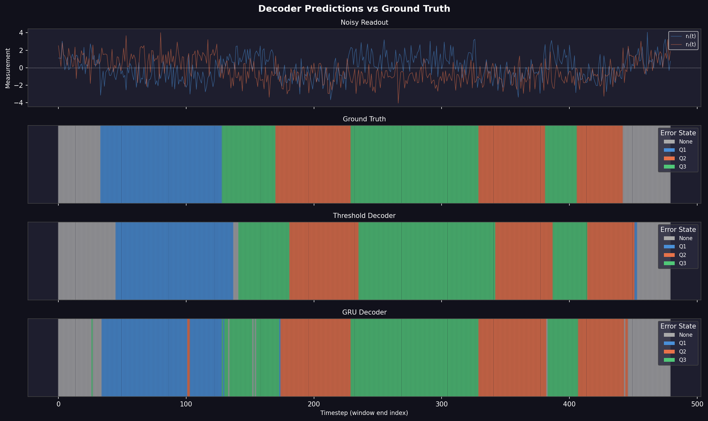
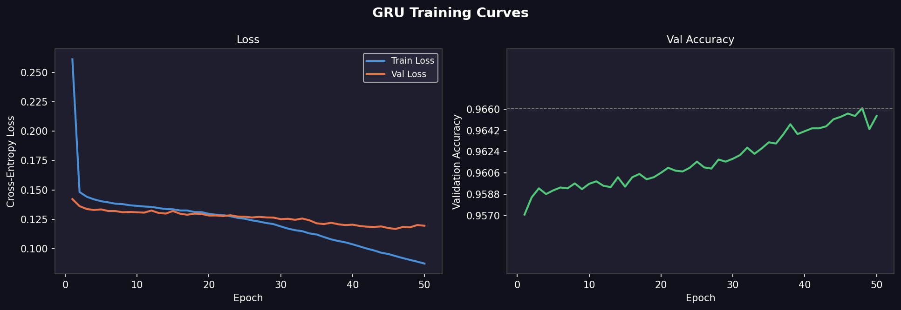
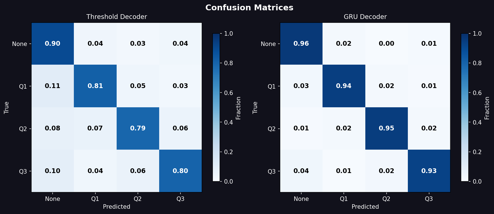
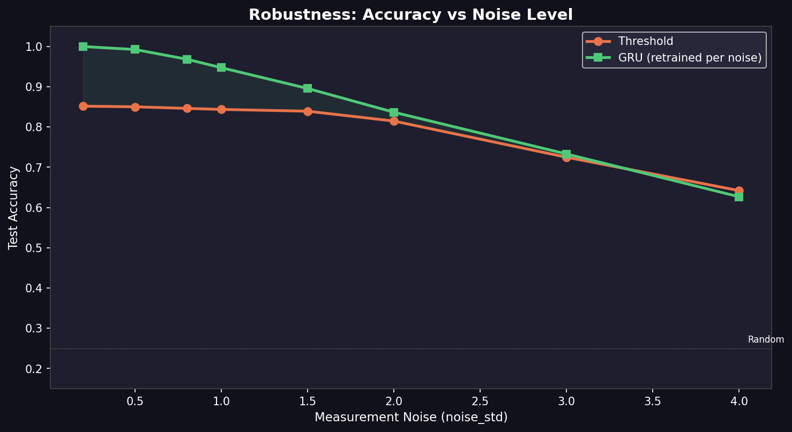
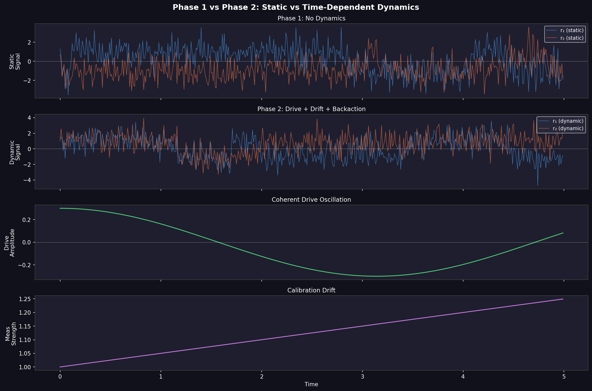
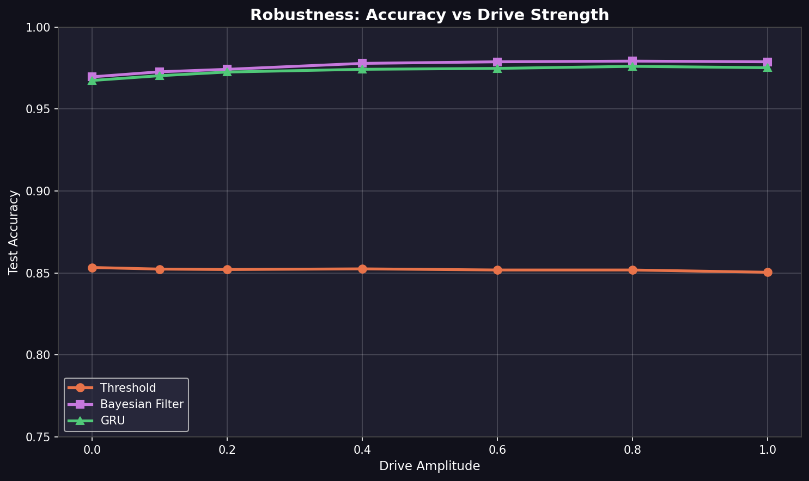
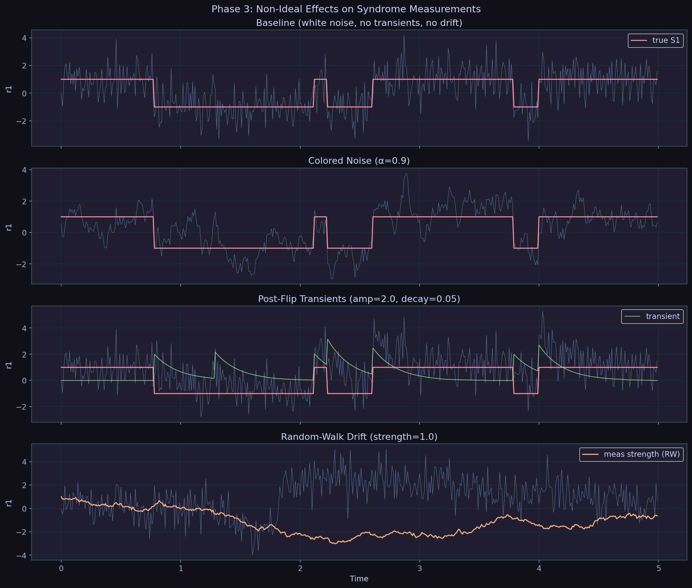
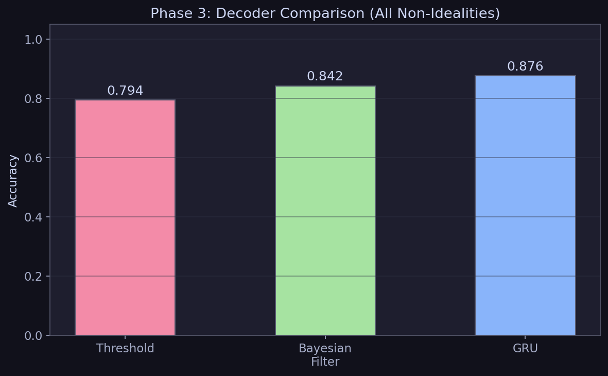
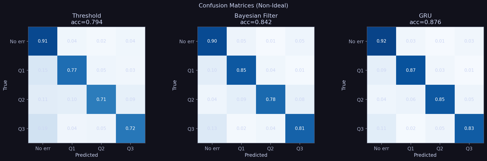
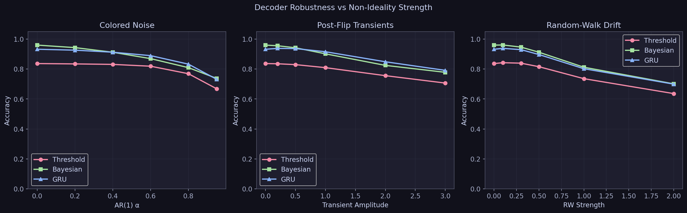

# Continuous Quantum Error Correction with ML Decoders

> Can a neural network decode quantum errors better than Bayes' theorem?

> **TL;DR:** ML-based decoders match or outperform Bayesian filters under realistic noise and drift, especially when model assumptions break.

**Authors:** Pranav Reddy ([preddy@ucsb.edu](mailto:preddy@ucsb.edu)) · Clark Enge ([clarkenge@ucsb.edu](mailto:clarkenge@ucsb.edu)) · Aidan Mitchell ([aidanpmitchell@ucsb.edu](mailto:aidanpmitchell@ucsb.edu))

## Showcase Presentation

This project placed 2nd at the UCSB Data Science Club Project Showcase (2026).

[View Project Presentation](CQEC_Presentation.pdf)

---

## The Problem

Quantum computers are noisy. A 3-qubit repetition code protects information by encoding it across qubits (`|0⟩ₗ = |000⟩`, `|1⟩ₗ = |111⟩`), but you need to *continuously* monitor stabilizer measurements to catch bit-flip errors before they corrupt your computation.

Traditional QEC extracts discrete syndrome bits. We instead work with **continuous analog readout** — noisy real-valued signals `r₁(t)` and `r₂(t)` that encode stabilizer eigenvalues buried in Gaussian noise. The question: **who decodes these signals best?**

```
No error:      S₁ = +1, S₂ = +1   →  r₁(t) ≈ +1 + noise
Flip qubit 1:  S₁ = -1, S₂ = +1   →  r₁(t) ≈ -1 + noise
Flip qubit 2:  S₁ = -1, S₂ = -1   →  both flip
Flip qubit 3:  S₁ = +1, S₂ = -1   →  r₂(t) ≈ -1 + noise
```

---

## Three Decoders, Head to Head

| Decoder | Type | How it works |
|---------|------|-------------|
| **Threshold** | Heuristic | Averages `r₁`, `r₂` over a window, checks the sign quadrant |
| **Bayesian Filter** | Probabilistic | Wonham filter / HMM — optimal under known noise model |
| **GRU Network** | Learned | Recurrent neural net that learns temporal patterns from data |

The **GRU** ([`src/decoders.py`](src/decoders.py)) processes measurement windows sequentially, building internal memory before classifying:

```python
class GRUDecoder(nn.Module):
    def __init__(self, input_size=2, hidden_size=64, num_classes=4):
        self.gru = nn.GRU(input_size, hidden_size, batch_first=True)
        self.classifier = nn.Sequential(
            nn.Linear(hidden_size, 32), nn.ReLU(),
            nn.Dropout(0.1), nn.Linear(32, num_classes)
        )

    def forward(self, x):
        output, h_n = self.gru(x)
        return self.classifier(h_n[-1])  # classify from final hidden state
```

The **Bayesian filter** ([`src/bayesian_filter.py`](src/bayesian_filter.py)) maintains a belief distribution over 4 error states, updating via Bayes' rule at each timestep:

```
For each measurement (r₁, r₂):
    1. Predict:  belief ← transition_matrix × belief
    2. Update:   belief ← belief × P(r₁, r₂ | state)
    3. Normalize: belief ← belief / sum(belief)
```

The **Threshold decoder** ([`src/decoders.py`](src/decoders.py)) is the simplest possible baseline — average the window, check the sign:

```python
r1_avg = X[:, :, 0].mean(axis=1)
r2_avg = X[:, :, 1].mean(axis=1)
# Quadrant → error class: (+,+)=0  (-,+)=1  (-,-)=2  (+,-)=3
```

---

## Four Phases of Increasing Realism

### Phase 1 — Static Syndromes

The baseline scenario ([`src/sim_measurement.py`](src/sim_measurement.py)): random bit-flip errors with constant measurement strength and i.i.d. Gaussian noise. The Bayesian filter's assumptions hold perfectly here.

```python
# Core measurement model (sim_measurement.py):
r1[t] = meas_strength * s1_true + rng.normal(0, noise_std)
r2[t] = meas_strength * s2_true + rng.normal(0, noise_std)
```

### Phase 2 — Time-Dependent Hamiltonian Dynamics

This is where it gets interesting ([`src/sim_hamiltonian.py`](src/sim_hamiltonian.py)). We add three physical effects that **break the Bayesian model's assumptions**:

- **Coherent drive** — sinusoidal oscillations modulate the syndrome signal even without errors
- **Calibration drift** — measurement strength changes linearly over time
- **Measurement backaction** — the act of measuring injects additional quantum noise

```python
# Phase 2 measurement model (sim_hamiltonian.py):
meas_strength_t[t] = meas_strength + drift_rate * t * dt
drive_signal[t] = drive_amplitude * cos(drive_frequency * t * dt)

r1[t] = (meas_strength_t[t] + drive_signal[t]) * s1_true + readout_noise + backaction_noise
```

The Bayesian filter assumes static `meas_strength` and no drive, so these dynamics introduce model mismatch. In the recorded Phase 2 run, however, the Bayesian filter remains highly competitive and outperforms the final trained GRU; the added drive and drift can also increase signal separability.

### Phase 3 — Non-Ideal Measurement Effects

Real quantum hardware has non-idealities that violate textbook assumptions ([`src/sim_nonideal.py`](src/sim_nonideal.py)):

- **Colored noise (AR(1) process)** — temporally correlated readout noise, not white Gaussian
- **Post-flip transients** — exponential ring-down artifacts after each error flip
- **Random-walk drift** — Brownian motion in measurement calibration

```python
# Phase 3 adds three non-idealities:
colored_noise[t] = alpha * colored_noise[t-1] + sqrt(1-alpha²) * white_noise[t]
transient[t] = amplitude * exp(-t / decay) * (1 if flip_occurred else 0)
random_walk[t] = random_walk[t-1] + normal(0, strength)
```

These effects violate the Bayesian filter's white-noise and static-parameter assumptions. On the combined Phase 3 test, the GRU performs best, but Bayesian decoding remains competitive and can outperform the GRU in some individual robustness sweeps.

### Phase 4 — Adaptive Decoding Under Drift

The ultimate challenge ([`src/sim_drifting.py`](src/sim_drifting.py), [`src/adaptive_gru.py`](src/adaptive_gru.py)): hardware parameters don't stay constant — they drift during operation.

- **Time-varying non-idealities** — colored noise, transients, and drift parameters change within a single trajectory
- **Adaptive GRU** — continues learning online via EMA-smoothed gradient updates
- **Three adaptation strategies** tested:
  1. **Static GRU** — trained once, frozen weights (baseline)
  2. **Pseudo-label adaptation** — self-training with confident predictions (fails under heavy drift)
  3. **Hybrid adaptation** — periodic true labels + pseudo-labels in between (modest gains with frequent recalibration)

```python
# Phase 4: Parameters drift over time
colored_noise_alpha[t] = interpolate(0.1 → 0.9, t, drift_type='linear')
transient_amplitude[t] = interpolate(0.1 → 1.0, t, drift_type='linear')

# Adaptive GRU: hybrid supervision mode
# Every N windows, inject a true label (periodic recalibration)
# In between, use high-confidence pseudo-labels
preds, history = model.predict_adaptive(
    X_test, y_true=y_test, supervised_every=20  # true label every 20 windows
)
```

Pure pseudo-label self-training significantly degrades performance because confident wrong predictions reinforce themselves. Hybrid recalibration can modestly improve overall accuracy when true labels are injected frequently, but it uses true test labels during inference and should be interpreted as an online recalibration setting rather than label-free deployment.

---

## Results

### Phase 1 — Static Syndromes

| Decoder | Accuracy |
|---------|----------|
| Threshold | ~86% |
| GRU | **~96%** |

The GRU learns temporal correlations in the continuous measurement stream that simple averaging misses.

### Phase 2 — Time-Dependent Dynamics

| Decoder | Accuracy | Notes |
|---------|----------|-------|
| Threshold | ~85% | No model, no adaptation |
| Bayesian Filter | **~95%** | Strongest in this recorded run |
| GRU | ~93% | Strong learned baseline, but does not beat Bayesian here |

Phase 2 introduces time-dependent measurement effects that mismatch the Bayesian filter's static observation model. In this parameter regime, that mismatch does not imply Bayesian degradation: Bayesian remains strongest, while the GRU remains a competitive learned baseline.

### Phase 3 — Non-Ideal Measurement Effects

| Decoder | Accuracy | Notes |
|---------|----------|-------|
| Threshold | ~79% | Simple averaging degrades under non-ideal effects |
| Bayesian Filter | ~84% | Assumptions are violated, but remains competitive |
| GRU | **~88%** | Best on the combined held-out Phase 3 test |

With colored noise, post-flip transients, and random-walk drift, all decoders degrade. The Bayesian filter suffers most because its core assumptions (white noise, static parameters) are violated. The GRU learns non-ideal effects from data but needs more training data to match Phase 2 performance.

### Phase 4 — Adaptive Decoding Under Drift

Five-way comparison under linearly drifting non-idealities (colored-noise α 0.1→0.9, transient amplitude 0.1→1.0, random-walk strength 0.01→0.4). Training: N=200 trajectories, T=1000, 50 epochs. Adaptation: `adapt_lr=0.005`, `ema_decay=0.5`, hybrid supervision every 20 windows.

| Decoder | Overall | Seg 1 (low drift) | Seg 5 (high drift) | Drop (pp) |
|---------|---------|-------------------|--------------------|-----------|
| Threshold | 71.8% | 84.7% | 57.2% | 27.5 |
| Bayesian Filter | 77.0% | 93.8% | 59.8% | 34.0 |
| Static GRU | 81.6% | 90.2% | 70.2% | 20.0 |
| Adaptive GRU (pseudo-labels) | 45.2% | 40.9% | 27.0% | 13.9 |
| Adaptive GRU (hybrid, every 20) | **83.7%** | 92.8% | 70.1% | 22.7 |

**Headline finding — pseudo-label degradation.** Pure self-training performs much worse than the frozen GRU (45.2% vs 81.6%) despite very high confidence. Confident-but-wrong pseudo-labels reinforce incorrect updates rather than correcting drift.

**Hybrid supervision gives modest gains with frequent recalibration.** Injecting a true label every 20 windows (~5% of samples) modestly improves overall accuracy over the static GRU (83.7% vs 81.6%). It does not prevent late-drift degradation: by the final segment, hybrid is roughly tied with static. Because hybrid uses true test labels during inference, it should be interpreted as online recalibration rather than label-free deployment.

**Supervision frequency sweep.** In this run, only frequent recalibration every 10–20 windows improves over the static GRU. At 50+ windows, hybrid no longer beats the static baseline and degrades as supervision becomes sparse.

### Evaluation Notes

- Notebook results are seed- and parameter-dependent; model mismatch does not always degrade Bayesian performance.
- Phase 3 robustness sweeps reuse the same seed as training and the GRU is not retrained per sweep, so they are diagnostic checks rather than fully independent benchmarks.
- Phase 4 adaptive evaluation processes the flattened test set sequentially, so adaptation state carries across trajectory boundaries.
- Phase 4 hybrid mode uses true test labels during inference for periodic recalibration; it is not a label-free deployment result.

### Figures

| | |
|---|---|
|  |  |
|  |  |
|  |  |
|  |  |
|  |  |

---

## Under the Hood

### Quantum Operators ([`src/operators.py`](src/operators.py))

The stabilizer code is built from scratch using tensor products of Pauli matrices:

```python
S1 = Z ⊗ Z ⊗ I    # Stabilizer 1: checks qubits 1,2
S2 = I ⊗ Z ⊗ Z    # Stabilizer 2: checks qubits 2,3

E0 = I ⊗ I ⊗ I    # No error
E1 = X ⊗ I ⊗ I    # Bit-flip on qubit 1
E2 = I ⊗ X ⊗ I    # Bit-flip on qubit 2
E3 = I ⊗ I ⊗ X    # Bit-flip on qubit 3
```

Each error produces a unique syndrome signature `(S₁, S₂)`, which is what the decoders try to infer from noisy measurements.

### Data Pipeline ([`src/datasets.py`](src/datasets.py))

Trajectories are sliced into overlapping windows of size `W`. The split happens at the **trajectory level** — not the window level — to prevent data leakage. Test windows come from entirely unseen noise realizations.

### Evaluation ([`src/metrics.py`](src/metrics.py))

Beyond overall accuracy, we track:

- **Per-class accuracy** — catches decoders that just predict "no error" all the time
- **Confusion matrices** — reveals which error pairs get confused
- **Detection latency** — how many timesteps after a flip before the decoder catches it (critical for real-time QEC)

---

## Repository Structure

```
├── src/
│   ├── operators.py          # Pauli matrices, stabilizers, error signatures
│   ├── sim_measurement.py    # Phase 1: static syndrome simulator
│   ├── sim_hamiltonian.py    # Phase 2: time-dependent Hamiltonian simulator
│   ├── sim_nonideal.py       # Phase 3: non-ideal measurement effects
│   ├── sim_drifting.py       # Phase 4: time-varying parameter drift
│   ├── datasets.py           # Windowing + trajectory-level train/test splits
│   ├── decoders.py           # Threshold baseline + static GRU decoder
│   ├── adaptive_gru.py       # Phase 4: adaptive GRU with hybrid supervision
│   ├── bayesian_filter.py    # Wonham filter / HMM decoder
│   ├── metrics.py            # Accuracy, confusion matrices, detection latency
│   ├── validate_operators.py     # 44 validation checks — quantum operator math
│   ├── validate_hamiltonian.py   # 58 validation checks — Phase 2 simulator
│   ├── validate_bayesian.py      # 22 validation checks — Bayesian filter
│   ├── validate_nonideal.py      # 99 validation checks — Phase 3 simulator
│   └── validate_adaptive.py      # 25 validation checks — Phase 4 adaptive decoder + hybrid supervision
├── notebooks/
│   ├── 01_phase1_setup.ipynb
│   ├── 02_phase2_dynamics.ipynb
│   ├── 03_phase3_nonideal.ipynb
│   └── 04_phase4_adaptive_decoding.ipynb
├── tests/
│   ├── test_datasets.py
│   ├── test_decoders.py
│   ├── test_simulators.py
│   └── test_validation_layout.py
├── presentation/
│   ├── adaptive_qec_slides.pptx  # Competition slide deck (22 slides)
│   ├── slides_content.md          # Slide-by-slide content reference
│   └── build_slides.py            # Script to regenerate slides
├── outputs/figures/               # Generated plots
├── scripts/
│   ├── healthcheck.py             # Quick sanity check
│   ├── validate_phase4_smoke.py   # Phase 4 end-to-end smoke validation
│   └── run_phase4_rerun.py
└── requirements.txt
```

---

## Getting Started

```bash
git clone https://github.com/pkarakala/cqec-ml-decoder.git
cd cqec-ml-decoder

python -m venv .venv
source .venv/bin/activate
pip install -r requirements.txt

# Sanity check
python scripts/healthcheck.py

# Run tests
python -m pytest

# Run the notebooks
jupyter notebook notebooks/01_phase1_setup.ipynb
```

### Running Tests

Run lightweight unit tests (fast, deterministic):

```bash
python -m pytest
```
These tests check:

- import structure
- dataset windowing
- simulator outputs
- decoder forward passes

### Running Validation Scripts

These are longer, script-style checks for scientific behavior and diagnostics.

```bash
python -m src.validate_operators      # 44 checks — quantum operator math
python -m src.validate_hamiltonian    # 58 checks — Phase 2 simulator
python -m src.validate_bayesian       # 22 checks — Bayesian filter
python -m src.validate_nonideal       # 99 checks — Phase 3 non-ideal effects
python -m src.validate_adaptive       # 25 checks — Phase 4 adaptive decoder + hybrid supervision
```

### Quick Healthcheck

```bash
python scripts/healthcheck.py
```

---

## Dependencies

Python 3.10+ · NumPy · PyTorch · SciPy · Matplotlib · Jupyter · scikit-learn

See [`requirements.txt`](requirements.txt) for the full list.

---

## Key Findings

### 1. ML Decoders Learn What Models Miss

The GRU decoder achieves competitive accuracy without knowing the underlying physics. Under Phase 2 dynamics, however, the Bayesian filter remains highly competitive and outperforms the final trained GRU in the recorded run, showing that model mismatch does not automatically imply Bayesian degradation.

### 2. Non-Idealities Create Model Mismatch

Phase 3 demonstrates that non-ideal measurement effects (colored noise, transients, random-walk drift) create meaningful mismatch for idealized observation models. The combined held-out test favors the GRU, but Bayesian decoding remains competitive and sometimes wins in individual robustness sweeps. However, as the temporal correlations become more pronounced, the Bayesian filter’s memoryless assumptions become increasingly misspecified, while the GRU can exploit these dependencies through its learned temporal representation.

### 3. Pure Self-Training Fails, Hybrid Needs Recalibration

Phase 4 reveals that pure pseudo-label adaptation substantially degrades performance: confident wrong predictions poison self-training under distribution shift. Hybrid adaptation gives a modest overall gain only with frequent true-label recalibration, and should be interpreted as an online supervised recalibration setting.

### 4. The Accuracy-Robustness Tradeoff

- Bayesian filter: Strong when assumptions approximately hold, and often competitive under moderate mismatch
- Static GRU: Strong overall under drift, but accuracy declines in later temporal segments
- Adaptive GRU (pseudo-labels): Degrades badly — confident wrong predictions reinforce mistakes
- Adaptive GRU (hybrid): Modest overall gain with frequent true-label recalibration; not label-free and does not prevent late-segment degradation

---

## Future Work

### Immediate Extensions
- Latency analysis for Phase 3 & 4 (detection delay with non-idealities and drift)
- Robustness sweeps for Phase 4 (performance vs drift rate, drift type)
- Meta-learning for faster adaptation
- Ensemble methods with multiple adaptation rates

### Scaling Up
- Graph neural networks exploiting stabilizer code topology
- Larger codes (5-qubit, 7-qubit surface code patches)
- Correlated noise models (cross-talk between qubits)
- Multi-qubit error patterns (correlated bit-flips)

### Real Hardware
- Benchmark on experimental data from superconducting qubits
- Transfer learning: pre-train on simulation, fine-tune on hardware
- Real-time decoding with latency constraints
- Integration with quantum control systems

---

## License

This project is for research and educational purposes.
